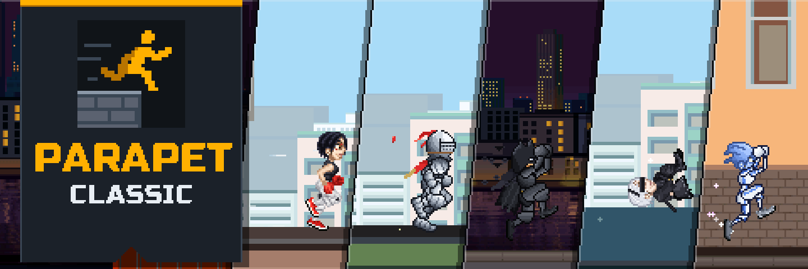

<p align="center">
  <a href="https://gwynerva.github.io/parapet-classic/"
    ></a>
</p>

<p align="center">
  <a href="https://gwynerva.github.io/parapet-classic/"
    ></a>
</p>

<p align="center">
  The 2007 mobile parkour classic <i>Playman Extreme Running</i>, remade for the browser.<br />
  Free, nothing to install, no account: on a desktop, a tablet or a phone.
</p>

## The game

Run, jump, vault, wall-run and flip across the rooftops of twelve levels. The movement is the
original's, reproduced exactly and checked step by step against the original game; the code is
new, a readable reference for this kind of game.

- **The original, complete.** Twelve levels with their missions (warm-ups with the coach,
  Sprint against the rival, Flag hunt, Score run, the Challenges), unlocks and the Prize, the
  Moves menu and the original music.
- **Ghost races.** Every record keeps its run. Race your best as a ghost, or send a run as a
  challenge link: whoever opens it (or pastes it into "Open replay") races your ghost, and
  their browser re-runs it, so a link cannot claim a time the run did not make.
- **Twelve bosses.** A character on every level with a record far below the original's. Beat
  its Sprint and it is yours to play; beat its Flag hunt and it brings its effect. See
  [`packages/content/bosses`](packages/content/bosses/README.md).
- **At home anywhere.** Wide screens, tablets and phones in either orientation, full screen
  and installable as an app; keyboard, touch and gamepad; English and Russian.

**Controls:** arrows or WASD run and do the tricks (the Moves menu shows each one); Enter or
Space confirms, Esc steps back, P pauses. Phones get touch buttons.

## Development

```bash
npm install
npm run extract   # decode the original game into packages/content/playman/extracted
npm run dev       # http://localhost:5173
npm run check     # format, types, tests
```

Node 24+. TypeScript and Canvas 2D, no engine: a deterministic integer simulation
(`packages/sim`), a browser runtime (`packages/runtime`), the game (`packages/classic`), the
tools and our content. Everything learned about the original is in `reference/`. The layout,
the tools and the dev pages: [`docs/DEVELOPMENT.md`](docs/DEVELOPMENT.md).

## The original and its rights holders

_Playman Extreme Running_ (2007) was made by Mr.Goodliving and published by RealNetworks. The
original game file in `packages/content/playman/original/`, the graphics, levels, music, texts
and move data extracted from it belong to their rights holders. Parapet Classic is a
non-commercial fan project, not affiliated with or endorsed by them. If you hold rights to the
game and want something removed, please open an issue.

## Privacy

The game loads nothing from other sites and keeps progress in the browser. The published site
counts visits and a few moments of play (a first run, a boss beaten) with GoatCounter: no
cookies, nothing that tells one player from another, and nothing at all when the browser asks
not to be tracked.
